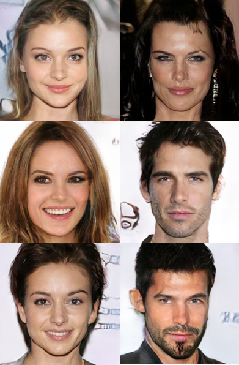

# ProGAN
This repository provides a straightforward, well-documented implementation of ProGAN in PyTorch. The goal is to replicate the original ProGAN paper as faithfully as possible, ensuring that the implementation closely mirrors the methods described in the paper. Although the results are comparable to those reported in the paper, training was not extended to 1024x1024 image resolution due to time limitations. Additionally, the model's size was slightly reduced by using fewer channels (below 512), which might impact the output quality. Example results are showcased below for reference.

## Results
||
|:---:|
||
||


### Celeb-HQ dataset
The dataset can be downloaded from Kaggle: [link](https://www.kaggle.com/lamsimon/celebahq).

### Training
To train the model:

Modify the config.py file according to your desired setup.
Execute train.py to start training.

## ProGAN paper
### Progressive Growing of GANs for Improved Quality, Stability, and Variation by Tero Karras, Timo Aila, Samuli Laine, Jaakko Lehtinen

#### Abstract
We investigate conditional adversarial networks as a general-purpose solution to image-to-image translation problems. These networks not only learn the mapping from input image to output image, but also learn a loss function to train this mapping. This makes it possible to apply the same generic approach to problems that traditionally would require very different loss formulations. We demonstrate that this approach is effective at synthesizing photos from label maps, reconstructing objects from edge maps, and colorizing images, among other tasks. Indeed, since the release of the pix2pix software associated with this paper, a large number of internet users (many of them artists) have posted their own experiments with our system, further demonstrating its wide applicability and ease of adoption without the need for parameter tweaking. As a community, we no longer hand-engineer our mapping functions, and this work suggests we can achieve reasonable results without hand-engineering our loss functions either.
```
@misc{karras2018progressive,
      title={Progressive Growing of GANs for Improved Quality, Stability, and Variation}, 
      author={Tero Karras and Timo Aila and Samuli Laine and Jaakko Lehtinen},
      year={2018},
      eprint={1710.10196},
      archivePrefix={arXiv},
      primaryClass={cs.NE}
}
```
